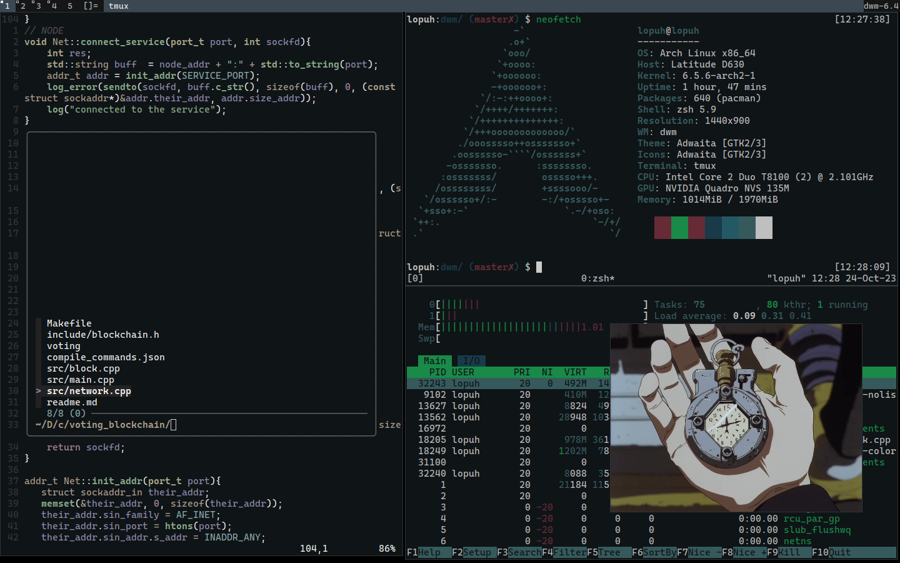

# preview

# CONTENT: 
<!-- - arch + i3wm + xterm -->
- arch + dwm + st + slstatus
- zsh + omzsh (z, fzf, highlighting, autosuggestions)
- vim \ nvim 

## fonts:
- cascadia code nerd (ttf-cascadia-code-nerd)
- awesome (ttf-awesome-font)

## install yay
```
pacman -S --needed git base-devel && git clone https://aur.archlinux.org/yay.git && cd yay && makepkg -si
```
## VIM
```sh
pacman -S vim
```
- install vim-plug
```sh
curl -fLo ~/.vim/autoload/plug.vim --create-dirs \
    https://raw.githubusercontent.com/junegunn/vim-plug/master/plug.vim
```
- install ycm 
.vimrc
```
call plug#begin()
    Plug 'ycm-core/YouCompleteMe'
call plug#end()
```
- install requirements
```sh
pacman -S cmake clang
cd ~/.vim/plugged/YouCompleteMe
python3 install.py --clangd-completer
```

## SHELL
- install zsh + tmux + fzf + omzsh
```sh
pacman -S zsh bear fzf tmux
```
- ohmyzsh:
```sh
sh -c "$(curl -fsSL https://raw.githubusercontent.com/ohmyzsh/ohmyzsh/master/tools/install.sh)"
```
- plugin manager for tmux:
```sh
git clone https://github.com/tmux-plugins/tpm ~/.tmux/plugins/tpm
```
- install plugins for zsh
```sh
git clone https://github.com/agkozak/zsh-z ${ZSH_CUSTOM:-~/.oh-my-zsh/custom}/plugins/zsh-z
git clone https://github.com/zsh-users/zsh-autosuggestions ${ZSH_CUSTOM:-~/.oh-my-zsh/custom}/plugins/zsh-autosuggestions
git clone https://github.com/zsh-users/zsh-syntax-highlighting.git ${ZSH_CUSTOM:-~/.oh-my-zsh/custom}/plugins/zsh-syntax-highlighting
```
## WM
- install wm
```sh
sudo pacman -S xorg xorg-xinit
git clone https://git.suckless.org/st 
git clone https://git.suckless.org/dwm
git clone https://git.suckless.org/slstatus
```
- compile by
```
sudo make clean install
```
- .xinitrc:
```
slstatus &
exec setxkbmap -layout us,ru -option grp:toggle &
exec dwm
```
- patches:
    - https://st.suckless.org/patches/anysize/st-anysize-0.8.1.diff (no gasps for st)

## stuff
- watch movies:     [lobster-git](https://github.com/justchokingaround/lobster)
- watch anime:      [ani-cli](https://github.com/pystardust/ani-cli)
- read manga:       [mangal](https://github.com/metafates/mangal)
- watch youtube:    [ytfzf](https://github.com/pystardust/ytfzf) 
- search internet:  [w3m](https://w3m.sourceforge.net/)
- podcasts:         [shellcaster](https://github.com/jeff-hughes/shellcaster)
- music:            [cmus](https://github.com/cmus/cmus)
- books:            [zathura](https://pwmt.org/projects/zathura/)
- krita
- htop
- anki

## theme:
```
Background color: #0f1417
Foreground color: #bfbfbf
Cursor color: #bfbfbf

Color codes for each of the 8 color slots:
0: #162025
1: #393843
2: #193a48
3: #235964
4: #193a48
5: #2a474a
6: #662b37
7: #bfbfbf

Additional color codes for the 8 color slots in bold text:
8: #365a5c
9: #662b37
10: #193a48
11: #193a48
12: #75404b
13: #662b37
14: #083842
15: #bfbfbf
```
## key bindings
### dwm
| KEY  | ACTION |
| ------------- | ------------- |
| `win + enter`  | open terminal (st)  |
| `win + shift + q` | close window  |
| `win + F1` | open firefox |
| `win + p` | open dmenu |
| `win + F3` | flame shot (gui) |
| `win + F2` | flame shot (screen)|
### VIM: 
| KEY  | ACTION |
| ------------- | ------------- |
| `ctrl + q` | close  |
| `ctrl + s` | save |
| `ctrl + o` | comment |
| `ctrl + f` | find (ctrlP) |
| `ctrl + x` | fix (ycm fixit) |
| `ctrl + c` | tab close |
| `ctrl + g` | tab next | 

