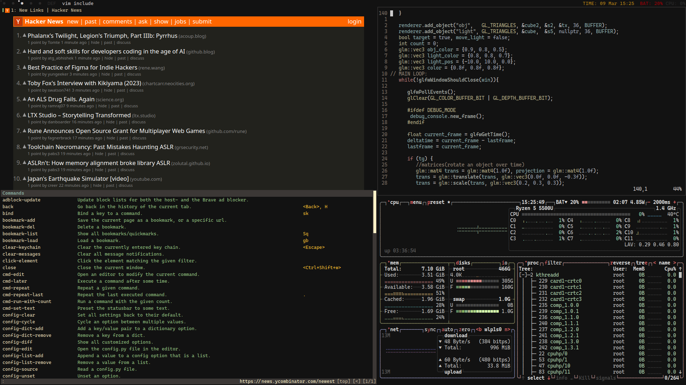

# preview

## fonts:
- cascadia code nerd (ttf-cascadia-code-nerd)
- awesome (ttf-awesome-font)
- Hack (ttf-hack)
- ttf-noto-emoji-monochrome

## patches and themes:
- [status2d](https://dwm.suckless.org/patches/status2d/dwm-status2d-20200508-60bb3df.diff) - colors in slstatus
- [primary monitor](https://github.com/dudik/herbe/pull/21) - for herbe
- [iceberg](https://github.com/maboroshin/qBittorrentDarktheme/blob/master/ICEBERG.qbtheme) - qbittorent theme
- materia-dark - gtk theme with numix circle icons

## apps: 

| TOOL             | ACTION              |
|------------------|---------------------|
| dwm              | windows manager     |
| dmenu            | menu                |
| slstatus         | status bar          |
| vim              | text editor         |
| mpv              | video player        |
| cmus             | music player        |
| zathura + zaread | file reader         |
| stterm + omzsh   | terminal            |
| fzf + ripgrep    | finder              |
| feh              | image viewer        |
| xrandr           | monitor setup       |
| qutebrowser      | lightweight browser |
| nmtui            | network manager tui |
| dmenu-bluetooth  | bluetooth manager   |
| ncdu             | memory scaner       |
| herbe            | notifications       |


## colors:
```
#121212 - black
#e6dbda - white
#d4cfd0 - white
#2b2a2a - gray

"#1a1818",//black
"#433c38",//brown
"#bab288", //yellow
"#9ea6b5", //blue
"#bab288", // yellow (orange)
"#999e98", // gray (aka green)
"#b0716f", //red
"#bfbfbf", //gray

"#171616",//black
"#2b2222",//brown
"#9c9678", //yellow
"#ebdfda", // gray

"#d4cfd0", /* default foreground colour */
"#121212", /* default background colour */

```

